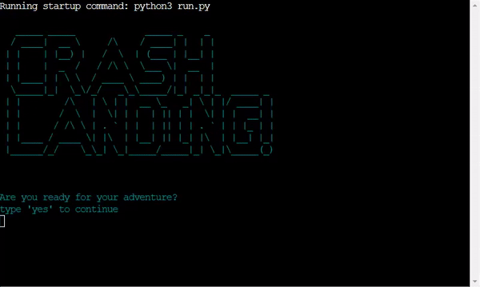
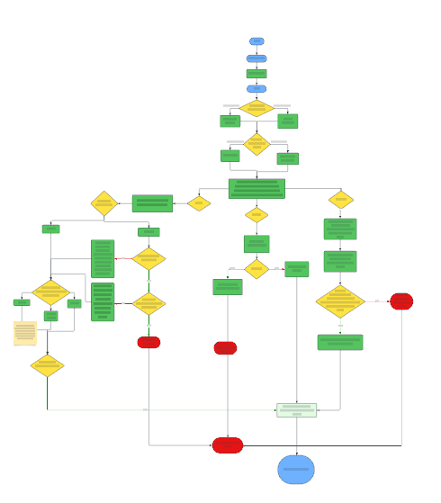
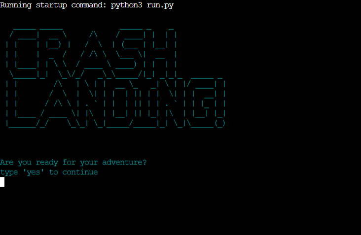
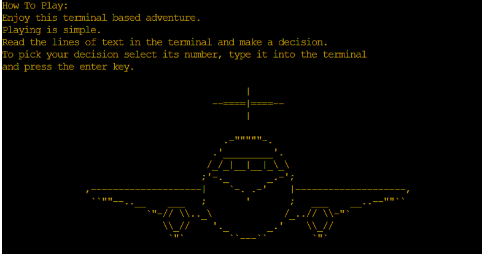
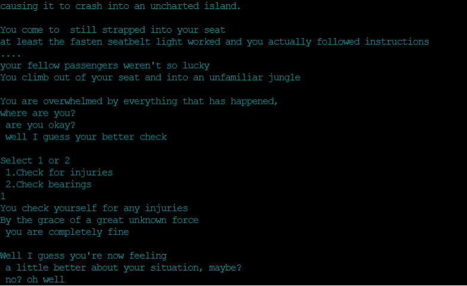
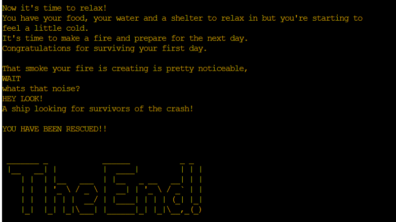
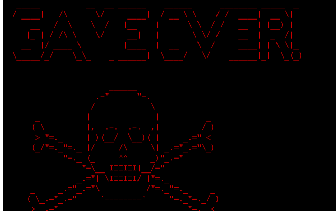

# ***Crash Landing!***

## ***Introduction***
Crash Landing is a text-based adventure game set on an uncharted island.
It is filled with quirky easter eggs and fun lines but is aimed for those who enjoy a fun and silly text-based game.

[Click here to view the deployed Page](https://crash-landing-ea802d1ccfaa.herokuapp.com/)

## ***Project Goals***

This portfolio project is my third for [Code Institute](https://codeinstitute.net/) and my goals are to display newly developed Python skills in this project.
I have built a text-based adventure game which is led by players choice, some of these choices will impact on the story progression.

---

## ***Contents***

 - [***Crash Landing!!***](#crash-landing)
  - [***Introduction***](#introduction)
  - [***Project Goals***](#project-goals)
  - [***Contents***](#contents)
  - [***User Experience*** (UX)](#user-experience-ux)    
    - [*User Stories*](#user-stories)
    - [*How To Play*](#how-to-play)    
  - [***User Experience Design (UXD)***](#user-experience-design-uxd)        
    - [*Colour Scheme*](#colour-scheme)        
    - [*Image Sourcing*](#image-sourcing)
    - [*Game Flow*](#game-flow)
  - [***Features***](#features)
    - [*General Features*](#general-features)
    - [*Future Enhancements*](#future-enhancements)
  - [***Technologies Used***](#technologies-used)
    - [*Languages Used*](#languages-used)
    - [*Frameworks, Libraries & Programs Used*](#frameworks-libraries--programs-used)
  - [***Testing***](#testing)
  - [***Deployment***](#deployment)
  - [***Credits***](#credits)
    - [*Content*](#content)
    - [*Media*](#media)

---

## ***User Experience*** (UX)
 
### *User Stories*
As a user, I want to be able to:
- To access a fun story throughout the game.
- Understand the aim of the story.
- Have a straightforward way to read the game instructions from within.

### *How to Play"
Playing is simple.
Read the lines of text in the terminal and make a decision.
To pick your decision select its number, type it into the terminal
and press the enter key.

---

## ***User Experience Design (UXD)***
### *Colour Scheme*
Cyan was chosen for the main text as to draw the players eyes and to be aesthetically pleasing.
Important details were coloured yellow, the difference is to draw the players eyes to it when necessary, The how to play and final sections are in yellow.
Finally the Game over screen is in red to give the sense of danger, it is also strikingly different to the cyan as to make the player aware something has happened.

### *Image Sourcing*
Ascii text and Ascii Art has been added to the game. This is to help keep the player engaged and provide an aesthetically pleasing experience. The Ascii font was provided by [patorjk.com](https://patorjk.com/software/taag/#p=display&f=Big&t=) and the font used was called "Big". The Ascii Art was provided by https://ascii.co.uk/art.

### *Game Flow*
The below flowchart was made to visualize the flow of the game and the functions used.

---

## ***Features***

### *General Features*
#### *Title*

A large banner to welcome the player to the game, with the option for the player to start playing. Colored Ascii text is used provide an aesthetically pleasing experience for the player.

#### *How To Play*

This feature is in the game to tell the player how to play the game.

#### *Game Play*

The main game play is comprised of text, providing choices for the player to make to advance the game and story.

#### *Final*

The final text describes the ending if the player makes it through the game unscathed.

#### *Game Over*

This screen displays if the player dies in the game and it brings the game to an end.

### *Future Enhancements*
In the future there a several elements I would like to add to the game
these would be a save game function and load game function for a player to save their progress.
The ability for the player to name their character.
An inventory system to chang the dynamic of the game.
Finally a more advance and in depth story to keep the player engaged for longer periods of time.

---

## ***Technologies Used***
### *Languages Used*
[Python](https://en.wikipedia.org/wiki/Python_(programming_language))

### *Frameworks & Programs Used*
- [Github](https://github.com/)
    - To save and store the files for the site.
- [Lucidchart.com](https://www.lucidchart.com/pages/)
    - The Lucidchart app was used to create the app's flowcharts.
- [ezgif.com](https://ezgif.com/)
    - Used to make a GIF from screen captured game play of the game.
- [gitpod](https://www.gitpod.io/)
   - Used to import code into visual studio code.
- visual studio code
    - used as the IDE for this project

### *Libraries*
#### *colorama:*
- Fore, Back & Style were imported from colorama in order to style and colour  the font, ASCII text, and ASCII art.
#### *random:*
- randint was used to provide the coconut challenge with a random percentage of success.
#### *time:*
- sleep was imported to delay the tet output to make it more aesthetically pleasing and less intimidating than having a wall of text just appear in front of the player

---

## ***Testing***
Please [click](https://github.com/TommySpecs/crash-landing/blob/main/testing.md) to visit the testing page.

---

## ***Deployment***
### GitHub
This project was developed using a specialized Code Institute template which simulates a terminal in the web browser.
- Click Use this template
- Name the repository
- Launch using the Gitpod web extension
- Pin project in Gitpod workspaces
- Version Control
For version control the following steps were made:

### Changes made to files in Gitpod
- Files  are made ready for commit with the command - git add .
- Commit using the following command and follow commit description e.g.  git commit -m "This is my commit etc"
- To then move the changes to Github the command was run - git push

### Final Deployment with Heroku
To deploy onto Heroku
- Go to Heroku and click "New" to create a new app.
- After choosing the app name and setting the region, press "Create app".
- If applicable to the project go to "Settings" and navigate to Config Vars. Add a Config Var with a keyword called PORT and a value of 8000.
- In the "Settings", navigate to buildpacks section and add packs Python and NodeJS (in order).
- Go to "Deploy". Scroll down and set Deployment Method to GitHub. Once GitHub is chosen, find your repository and connect it to Heroku.
- Scroll down to Manual Deploy, make sure the "main" branch is selected and click "Deploy Branch".
The deployed app can be found [here](https://crash-landing-ea802d1ccfaa.herokuapp.com/).

---

## ***Credits***

### *Content*
https://www.geeksforgeeks.org/print-the-content-of-a-txt-file-in-python/ - Used to print text files
https://stackoverflow.com/questions/3996904/generate-random-integers-between-0-and-9 - How to use Randint
https://www.w3schools.com/python/python_for_loops.asp - used for making loops
https://www.w3schools.com/python/python_lists_remove.asp - removing items from lists
https://www.geeksforgeeks.org/python-program-to-convert-a-list-to-string/ - converting lists to strings
