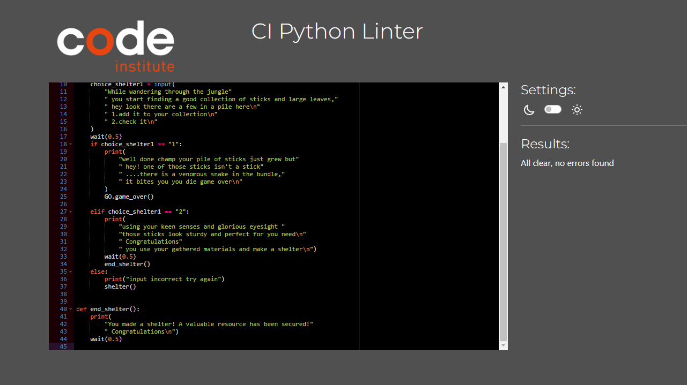

# **Crash Landing! Testing**

## **Testing Overview**
A range of testing was carried out during the developement of this game to ensure it was working and player ready.

## **Contents**

- [Testing Overview](#testing-overview)
- [Manual Testing](#manual-testing)
- [Validators](#validators)
- [Bugs & Fixes](#bugs--fixes)

---

## **Manual Testing**

- The code has been separated into separate files to make it easier to manage and to test seperate sections of the game as it was developed each section was linked to each other to ensure smooth running and operation of the game.

- The print() method was used throughout to test for errors. This helped check each feature was behaving as expected during developement.

- The game was deployed early on in development and checked regularly to ensure game flow and any errors were handled early on.

- During validation errors or warnings were fixed as they appeared such as indentation errors, lines too long, or extra space issues. This helped keep the code clean and readable so that other errors or bugs that arose were identified more easily.

---

## **Validators**

The [CI Python Linter](https://pep8ci.herokuapp.com/) was used to validate the python code that was used throughout the project.

### *run.py*

### *intro.py*

### *game start.py*

### *water.py*

### *food.py*

### *shelter.py*

### *final.py*

### *gameover.py*

---

## **Bugs & Fixes**

|               Bug               |                How I fixed it                      |
|---------------------------------|----------------------------------------------------|     
| Non launching game              |  Due to indentation or syntax errors that were found and corrected |
| Choices being accepted as options when removed from loop| By adding a second condition to ensure the player cannot choose the removes option   | 
|Game restarting with previous results | Fixed by making the game come to a complete end and getting to restart manually |